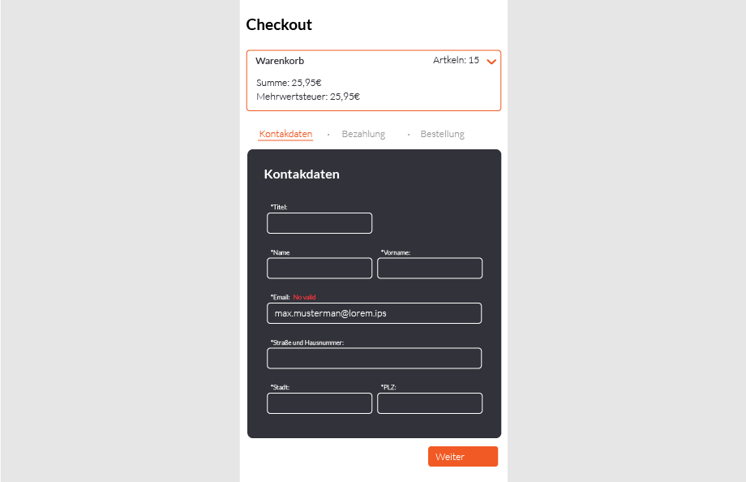

# Checkout Prozess

- [Checkout Prozess](#checkout-prozess)
  - [Projekt Umsetzung](#projekt-umsetzung)
  - [Tasks](#tasks)
  - [Kommunikationsprozess](#kommunikationsprozess)
      - [Fragen:](#fragen)
  - [Endpoints](#endpoints)
      - [Fragen:](#fragen-1)
    - [Warenkorb](#warenkorb)
      - [Fragen:](#fragen-2)
    - [Payment](#payment)
    - [Order](#order)
  - [Client-App](#client-app)
    - [Layout](#layout)
    - [Form Elements](#form-elements)
      - [Kontakdaten](#kontakdaten)
      - [Bezahlinformationen](#bezahlinformationen)
      - [Bestellabschluss](#bestellabschluss)
      - [Auftragsbestätigung](#auftragsbest%C3%A4tigung)
    - [Entwicklung](#entwicklung)
      - [Installation](#installation)
      - [Usage](#usage)


## Projekt Umsetzung


## Tasks
**Trello:** https://trello.com/b/TwMh9gqu/checkout

## Kommunikationsprozess


#### Fragen:
- Fehler -Cases/Meldungen
- Validierung von Daten
- Speicherung von Daten: session, ids, local store, cookies
- ...

## Endpoints

#### Fragen:
- Routen / Parameter
- Error Cases / Responses
- Keys - Übersetzungen

### Warenkorb
**Path:** /checkout/?cart={cartId}   
GET  
**! Example:** http://motuo.info/checkout/?cart=12  
**Example:** http://motuo.info/checkout/cart/12  
**Success Response**:
```
{
  "cartId": "234509876HIFh",
  "products":[
    {
      "id": "1234567PRO",
      "units": 2,
      "name": "Special Product 1"
    },
    {
      "id": "98765456PRO",
      "units": 5,
      "name": "Special Product 2"
    },
  ],
  "price": "25.95",
  "taxes": "7.25",
  "totalPrice": "33,20"
  "shippingCost": "0"
}
```
#### Fragen:
- Parameter
- Ids, Number Format: str/int, Kommas
- zusätzliche Keys: Währung, Product Infos,

- ...

### Payment
**Path:** /checkout/?payment={customerId}  
GET  
**! Example:** http://motuo.info/checkout/?payment=987654   
**Example:** http://motuo.info/checkout/payment/987654   
**Success Response**:
```
{
  "isValid":false,
  "message":"",
}
```

### Order
**Path:** /checkout/?order={orderId}  
POST  
**! Example:** http://motuo.info/checkout/?order=12  
**Example:** http://motuo.info/checkout/order  
**Body**:
```
{
  "cartID":"234509876HIFh",
  "...":""
}
```

**Success Response**:
```
{
  "orderID":"ord-3456789098765",
  "customerName":"Max Musterman",
  "customerEmail":"max@ipsum.lo",
  "customerAddress":"Loremipsumstr. 12",
  "newsletterSubscribe": true
}
```

## Client-App

### Layout




### Form Elements
- Required Optional Elementen
- Validierung

#### Kontakdaten
- Titel, Anrede, Vorname, Name
- Email, Tlf,
- Straße, Hausnummer, PLZ, Ort, Land
- Gast?

#### Bezahlinformationen
- Gutscheincode?
- Kartennummer
- Ablaufdatum: Monat, Jahr, Sichersheitcode
- Name des Karteneinhabers
- Rechnungadresse, Hausnummer, ...

#### Bestellabschluss
- Zusammenfassung
- Checkboxes:  AGBs(required) und Newsletter(optional)

#### Auftragsbestätigung
- Text, Infos, Links, Navigation

---
### Entwicklung

#### Installation
```
npm i
```

#### Usage
**Development**
```
npm run start:port
```

**Distribution**
```
npm run build
```
