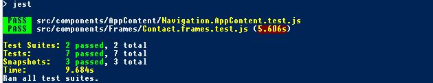

# Checkout Prozess

- [Checkout Prozess](#checkout-prozess)
	- [Projekt Umsetzung](#projekt-umsetzung)
	- [Tasks](#tasks)
	- [Kommunikationsprozess](#kommunikationsprozess)
	- [Endpoints](#endpoints)
		- [Warenkorb](#warenkorb)
		- [Payment](#payment)
		- [Order](#order)
	- [Client-App](#client-app)
		- [Layout](#layout)
		- [Komponenten](#komponenten)
		- [Form Elements, Felder](#form-elements-felder)
			- [Kontakdaten](#kontakdaten)
			- [Bezahlinformationen](#bezahlinformationen)
			- [Bestellabschluss](#bestellabschluss)
			- [Auftragsbestätigung](#auftragsbestätigung)
		- [Libraries](#libraries)
		- [Entwicklung](#entwicklung)
			- [Installation](#installation)
			- [Usage](#usage)
			- [Test](#test)

## Projekt Umsetzung


## Tasks
**Trello:** https://trello.com/b/TwMh9gqu/checkout  


## Kommunikationsprozess


#### Fragen:
- Fehler -Cases/Meldungen
- Validierung von Daten
- Speicherung von Daten: session, ids, local store, cookies
- ...

## Endpoints

#### Fragen:
- Routen / Parameter
- Error Cases / Responses
- Keys - Übersetzungen

### Warenkorb
**Path:** /checkout/?cart={cartId}   
GET  
**! Example:** http://motuo.info/checkout/?type=cart&cart=12  
**Success Response**:
```
{
  "cartId": "234509876HIFh",
  "products":[
    {
      "id": "1234567PRO",
      "units": 2,
      "name": "Special Product 1"
    },
    {
      "id": "98765456PRO",
      "units": 5,
      "name": "Special Product 2"
    },
  ],
  "price": "25.95",
  "taxes": "7.25",
  "totalPrice": "33,20"
  "shippingCost": "0"
}
```
#### Fragen:
- Parameter
- Ids, Number Format: str/int, Kommas
- zusätzliche Keys: Währung, Product Infos,

- ...

### Payment
**Path:** /checkout/?payment={customerId}  
GET  
**! Example:** http://motuo.info/checkout/?type=payment&payment=154    
**Success Response**:
```
{
  "isValid":false,
  "message":"",
}
```

### Order
**Path:** /checkout  
POST  
**! Example:** http://motuo.info/checkout   
**Body**:
```
{
  "cartId":"234509876HIFh",
  "...":""
}
```

**Success Response**:
```
{
  "orderID":"ord-3456789098765",
  "customerName":"Max Musterman",
  "customerEmail":"max@ipsum.lo",
  "customerAddress":"Loremipsumstr. 12",
  "newsletterSubscribe": true
}
```

## Client-App

### Layout


*source: https://dribbble.com/*

#### Entwurf


### Komponenten


### Form Elements, Felder
>Required Optional Elementen  
 Validierung

#### Kontakdaten
- Titel, Anrede, Vorname, Name
- Email, Tlf,
- Straße, Hausnummer, PLZ, Ort, Land
- Gast?
- Buttons (Weiter)

#### Bezahlinformationen
- Gutscheincode?
- Kartennummer
- Ablaufdatum: Monat, Jahr, Sichersheitcode
- Name des Karteneinhabers
- Rechnungadresse, Hausnummer, ...  
- Buttons (Weiter, Zurück)

#### Bestellabschluss
- Zusammenfassung
- Checkboxes:  AGBs(required) und Newsletter(optional)  
- Buttons (Weiter, Zurück)

#### Auftragsbestätigung
- Text, Infos, Links, Navigation

### Libraries
**React:** 16.8.1  
+
- **Css:**  bootstrap, react-bootstrap, styled-components
- **Icons:**  fortawesome, react-spinners
- **Test:**  jest, react-test-rendere

---
### Entwicklung

#### Installation
```
npm i
```

#### Usage
**Development**
```
npm run start:port
```

**Build**
```
npm run build
```

#### Test
```
npm run test
```

**Snapshots, Unit-Tests**  
> **Navigation.AppContent.test.js**  
<a href="https://github.com/chema-mengibar/checkout/blob/master/client-app/src/components/AppContent/Navigation.AppContent.test.js" target="_blank"> View code in Github</a>

> **Contact.frames.test.js**  
<a href="https://github.com/chema-mengibar/checkout/blob/master/client-app/src/components/Frames/Contact.frames.test.js" target="_blank"> View code in Github</a>
>



### ♥ Recherche

##### Forms
https://reactjs.org/docs/forms.html  
https://react-bootstrap.github.io/components/input-group/  
https://react-bootstrap.github.io/components/forms/  

##### Test React
https://reactjs.org/docs/test-renderer.html  

##### CSS, Icons
https://www.styled-components.com/docs/api  
https://react-bootstrap.github.io/  
https://fontawesome.com/icons/  
https://fontawesome.com/cheatsheet
